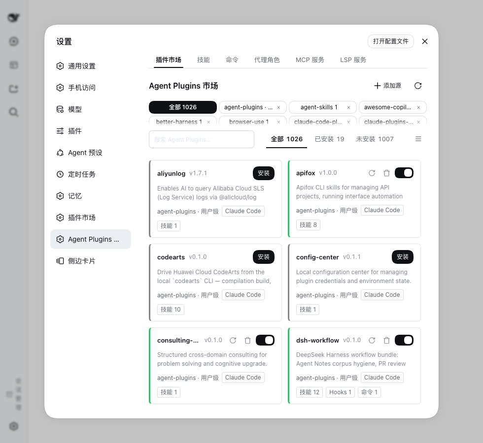
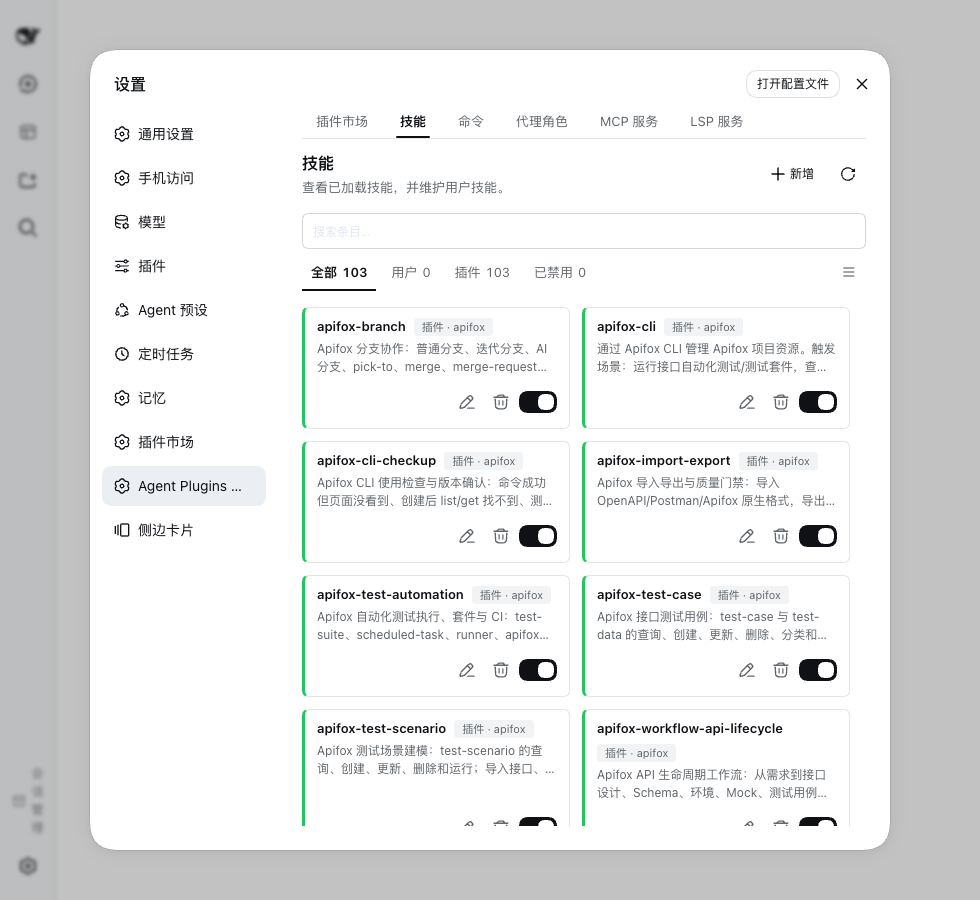
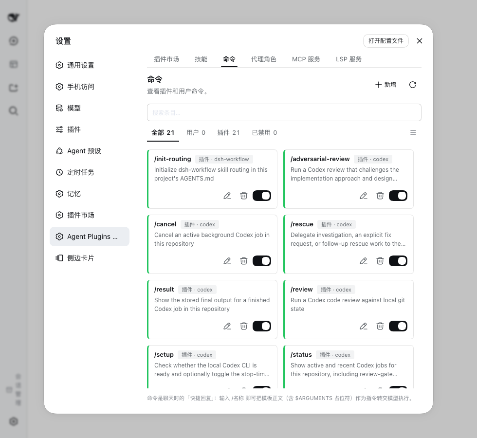
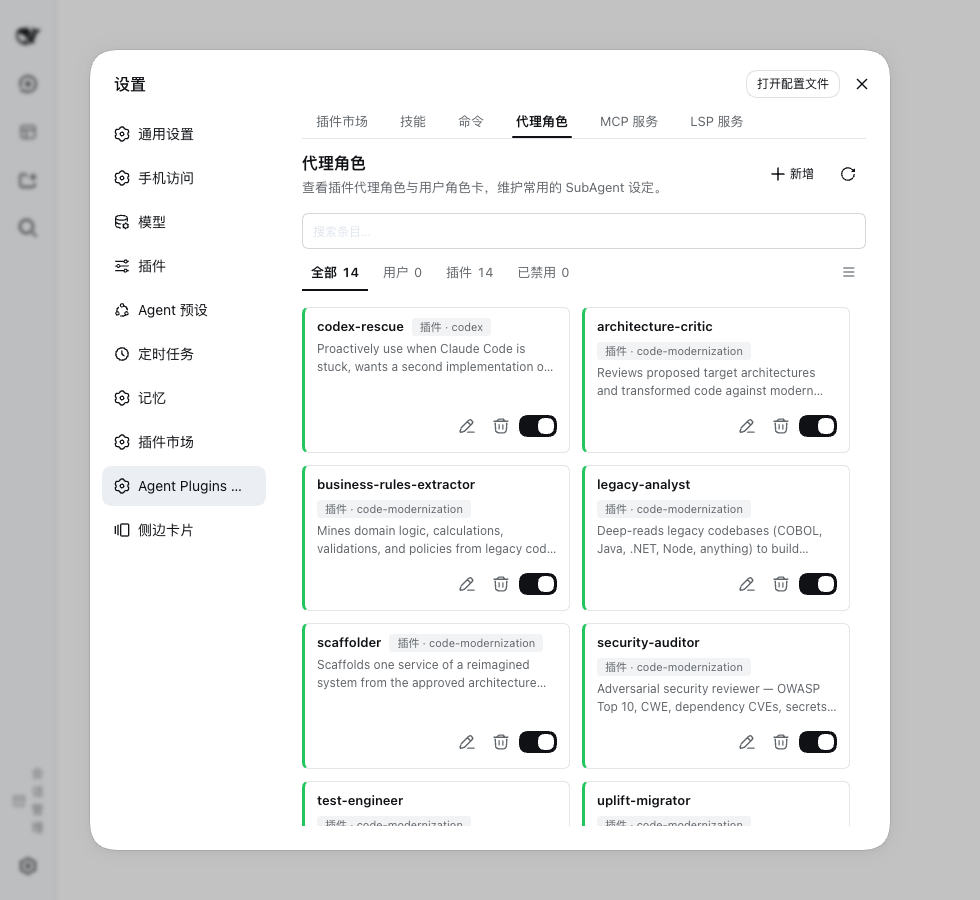
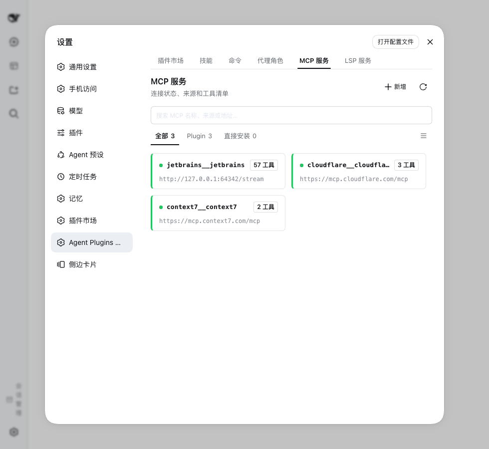
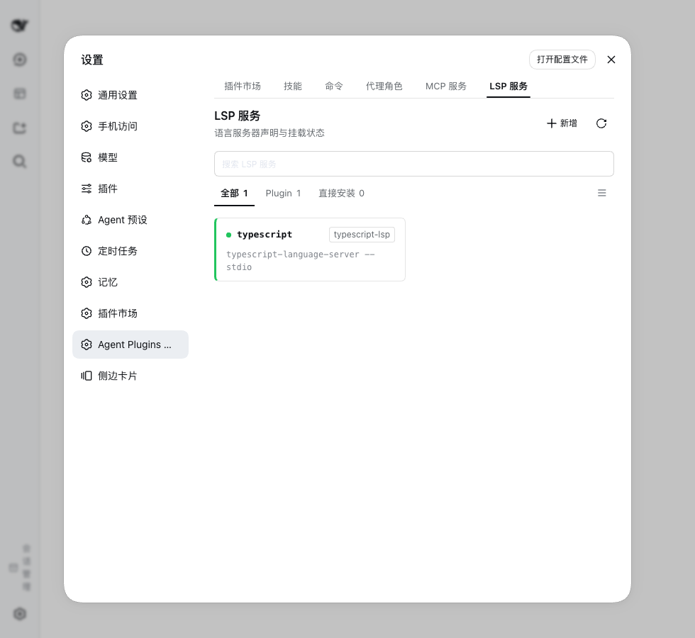

# dsh-agent-plugins-market

**A plugin marketplace and agent capability workspace for [DeepSeek Harness (DSH)](https://github.com/deepseek-ai/deepseek-harness).**

Reuse supported content from Claude Code, Codex, Cursor, Kimi and other recognized layouts, and manage your own skills, commands, agent personas, MCP services and LSP servers in the DSH Web GUI.

If this plugin is useful to you, a ⭐ on [GitHub](https://github.com/Sivan757/dsh-agent-plugins-market) is appreciated.

English | [简体中文](README.zh.md) | [Documentation](https://sivan757.github.io/dsh-agent-plugins-market/) | [npm](https://www.npmjs.com/package/dsh-agent-plugins-market)

[](https://www.npmjs.com/package/dsh-agent-plugins-market) [](LICENSE)

[Quick start](#quick-start) · [Everyday use](#everyday-use) · [Compatibility](#compatibility-and-boundaries) · [FAQ](#faq)

## Pages

<table>
  <tr>
    <td align="center" width="33%">
      <br />
      <b>Market</b><br />Add sources, preview suites, install and enable.
    </td>
    <td align="center" width="33%">
      <br />
      <b>Skills</b><br />Browse skills and author your own.
    </td>
    <td align="center" width="33%">
      <br />
      <b>Commands</b><br />Manage prompt templates invoked as /name.
    </td>
  </tr>
  <tr>
    <td align="center" width="33%">
      <br />
      <b>Agent personas</b><br />Roles with an exact provider, model and effort.
    </td>
    <td align="center" width="33%">
      <br />
      <b>MCP services</b><br />Credentials, authorization and connection status.
    </td>
    <td align="center" width="33%">
      <br />
      <b>LSP servers</b><br />Language server configuration and runtime status.
    </td>
  </tr>
</table>

## What you can do

- **Ten suite layouts.** Claude Code, Codex, Cursor, Kimi Code, ZCode, Qoder CLI, GitHub Copilot CLI, Universal `.plugin/`, [agent-plugins](https://agent-plugins.org) and manifest-less skill collections.
- **Sources.** Add a Git repository, a local directory or an archive (`.zip` / `.tar.gz` / `.tgz` / `.tar`); adopt a checkout you cloned yourself; refresh on demand; delete a managed checkout when you remove its source.
- **Downloads that fit your network.** Pick a download region — default `auto` follows the interface language, or choose global / China mainland — and the plugin routes `github.com` clones through the matching mirror. A proxy and per-invocation tuning live in the host config.
- **Runtime surfaces.** Enabled suites inject into sessions: skills into the catalog and slash menu, commands as `/name`, agent personas into the subagent catalog, MCP tools with an `mcp__` prefix, hooks onto host lifecycle events, and language servers through the `lsp` tool.
- **MCP.** A built-in bridge runs stdio, Streamable HTTP with OAuth and legacy SSE without a host MCP client. `${VAR}` references resolve from the host credential store or the launch environment; per-server overrides disable or patch a declaration without editing the source; an optional host-client compatibility mode is available. Tools register as `mcp__<suite>__<server>__<tool>`.
- **LSP.** Self-provisioned: installing the plugin is the whole setup, and the `lsp` tool mounts only while a language server is wanted. The server executable itself must be on `PATH`.
- **Agent personas and delegation.** Role cards save an exact provider, model and reasoning effort; they appear in the session catalog and run through `subagent_run`, which starts a durable background child and returns its id immediately.
- **Project dimension.** Skills, agents, commands, MCP servers and hooks are read from the project's own directories with no install step.
- **Your own resources.** Author skills, commands and agent personas as Markdown under `~/.agents/`, then edit them or disable them without deleting the files.
- **Background source updates.** Optionally refresh every configured source on a timer; off by default.
- **Web workspace.** Six tabs — Market, Skills, Commands, Agent personas, MCP services and LSP servers — each with search, filters and a grid/list toggle, plus status panels with diagnostics, credential editing, and an install confirmation that warns before executable third-party content is enabled.
- **Bilingual interface and feedback.** Workspace strings and injected prompts follow the host language. With feedback enabled, the model can file a `report_market_issue` report through the `gh` CLI or a GitHub token; with neither, it opens a prefilled GitHub issue page and hands you the complete issue text.

## Quick start

Install into your profile, replacing `<name>` with its name:

```sh
dsh plugin --profile <name> add dsh-agent-plugins-market
```

1. Restart DSH and open **Settings → Agent Plugins Market**.
2. In **Market**, add a source, for example `https://github.com/anthropics/claude-plugins-official`. No sources are preconfigured.
3. Open a suite, review its contents, then install it and ensure it is enabled.
4. For a suite with skills, check the **Skills** tab and type `/` in chat to find its user-invocable skills. For an MCP suite, check **MCP services** and resolve any credential or connection notice before using its tools.

Requirements, profile configuration and alternative installs: [usage guide](docs/guides/usage.md#installation-options).

## Everyday use

The workspace has six tabs:

| Tab            | Use it to                                                                                                                                    |
| -------------- | -------------------------------------------------------------------------------------------------------------------------------------------- |
| Market         | Add sources, preview suites, install / uninstall, enable / disable and refresh.                                                              |
| Skills         | Browse skills and create or edit your own reusable instructions.                                                                             |
| Commands       | Manage prompt templates invoked as `/name`.                                                                                                  |
| Agent personas | Manage role instructions and save an exact provider, model and reasoning effort per role; delegate in the background through `subagent_run`. |
| MCP services   | Add a service or configure an installed one, its credentials and authorization; inspect status and retry failures.                           |
| LSP servers    | Add and configure language servers and inspect their runtime status.                                                                         |

A **source** is where content comes from; a **suite** is an installable unit discovered there. Adding a source discovers its suites. Installing and enabling a suite controls its runtime capabilities.

Everything you author yourself lives in the shared Agent layout root: skills, commands and personas as Markdown under `~/.agents/`, and the MCP and LSP services you add in the workspace in `~/.agents/mcp.json` and `~/.agents/lsp.json`. Project-native resources stay in the project. See [storage and discovery](docs/guides/usage.md#storage-and-discovery) for paths and precedence.

All six tabs share a saved grid/list preference. Add and refresh actions sit at the top right; resource state rails are green when active.

## Compatibility and boundaries

Supported **layout dialects** describe how files are organized. The [shared priority table](#layout-detection-precedence) lists suite manifests and Marketplace catalogs together. All ten layout contracts in [`schemas/`](schemas/README.md) have independent reader tests; [the layout audit](docs/layout-coverage.md) maps them to pinned repository fixtures.

Supported **runtime surfaces** describe what DSH can use:

| Surface  | Runtime support and conditions                                                                                                                                |
| -------- | ------------------------------------------------------------------------------------------------------------------------------------------------------------- |
| Skills   | Host skill catalog and user-invocable slash entries; supported root placeholders are expanded.                                                                |
| Commands | Slash commands through the host command service.                                                                                                              |
| Agents   | Dynamic subagent catalog and `subagent_run`; requires host agents, tools, LLM, subagent and session-persistence services.                                     |
| MCP      | Built-in bridge by default: stdio, Streamable HTTP with OAuth, and legacy SSE. Optional host-client compatibility mode is also available.                     |
| Hooks    | The command-hook subset mapped by `dsh-hooks-claude-code`.                                                                                                    |
| LSP      | Self-provisioned: installing the plugin is the whole setup, and `lsp` mounts only while a language server is wanted; the server executable must be on `PATH`. |

Agent roles appear in the session catalog and run through `subagent_run(agent, prompt)`. A role may save an exact `provider` plus `model` pair and a `reasoning_effort`; every other declaration is ignored and the child inherits the parent route. `tools` and `disallowedTools` are preserved in the file but never applied. See [agent roles](docs/guides/agent-roles.md) for the frontmatter fields and limits.

### Layout detection precedence

When multiple manifests exist in the **same suite directory**, the first existing file in this order selects the layout:

| Priority | Layout | Suite manifest | Marketplace catalog |
| --- | --- | --- | --- |
| 1 | [agent-plugins](https://agent-plugins.org) / root compatibility | `plugin.json` | No dedicated catalog |
| 2 | Universal compatibility | `.plugin/plugin.json` | `.plugin/marketplace.json` |
| 3 | Claude Code | `.claude-plugin/plugin.json` | `.claude-plugin/marketplace.json` |
| 4 | Cursor | `.cursor-plugin/plugin.json` | `.cursor-plugin/marketplace.json` |
| 5 | Kimi Code | `kimi.plugin.json`, then `.kimi-plugin/plugin.json` | `.kimi-plugin/marketplace.json` |
| 6 | Codex | `.codex-plugin/plugin.json` | `.agents/plugins/marketplace.json`, then `.agents/plugins/api_marketplace.json` |
| 7 | ZCode | `.zcode-plugin/plugin.json` | No dedicated catalog |
| 8 | Qoder CLI | `.qoder-plugin/plugin.json` | `.qoder-plugin/marketplace.json` |
| 9 | GitHub Copilot CLI | `.github/plugin/plugin.json` | `.github/plugin/marketplace.json` |
| Fallback | Skill collection / shared catalog | Discover skills when no recognized manifest exists | Root `marketplace.json` |

- **Manifests are tried in order:** a manifest that cannot be read or validated is reported and the next one is tried, down to the fallback. If every candidate fails, the suite is diagnosed instead of loading half of it.
- **Component fallback:** for a root `plugin.json` that does not declare a recognized agent-plugins `$schema`, missing component declarations can come from `.claude-plugin/plugin.json`; explicit root declarations win, and marketplace entry declarations fill remaining gaps.
- Marketplace catalogs follow the same order: the first catalog that produces suites wins, and invalid or empty catalogs allow the next candidate to be tried.

The order is defined in [`src/model/layouts.ts`](src/model/layouts.ts); selection and root-manifest fallback are implemented in [`src/catalog/manifests.ts`](src/catalog/manifests.ts).

### Layout support matrix

The table says per layout whether this plugin reads a given surface at all. **Yes** means the layout's own files are read and injected; **Partial** means only part of the formats is understood, or the upstream layout has no such definition — the notes below say which. Evidence: the [compatibility report](docs/compat-report.md) and [layout audit](docs/layout-coverage.md).

| Layout                                                                                                        | Skills | Agents  | Commands | MCP     | Hooks   | LSP     |
| ------------------------------------------------------------------------------------------------------------- | ------ | ------- | -------- | ------- | ------- | ------- |
| [Claude Code](https://code.claude.com/docs/en/plugins-reference)                                              | Yes    | Yes     | Yes      | Yes     | Partial | Yes     |
| [Codex](https://developers.openai.com/plugins/build/plugins)                                                  | Yes    | Yes     | Yes      | Partial | Partial | Yes     |
| [Cursor](https://cursor.com/docs/reference/plugins)                                                           | Yes    | Partial | Partial  | Partial | No      | Yes     |
| Kimi Code                                                                                                     | Yes    | Yes     | Yes      | Yes     | Partial | Partial |
| [ZCode](https://zcode.z.ai/en/docs/plugin) `.zcode-plugin/`                                                   | Yes    | Yes     | Yes      | Yes     | Partial | Partial |
| [Qoder CLI](https://docs.qoder.com/cli/plugins-reference) `.qoder-plugin/`                                    | Yes    | Yes     | Yes      | Partial | Partial | Partial |
| [GitHub Copilot CLI](https://docs.github.com/en/copilot/reference/copilot-cli-reference/cli-plugin-reference) | Yes    | Yes     | Yes      | Yes     | Partial | Yes     |
| Universal compatibility layout `.plugin/`                                                                     | Yes    | Yes     | Yes      | Yes     | Partial | Yes     |
| [agent-plugins](https://agent-plugins.org)                                                                    | Yes    | Partial | Partial  | Yes     | Partial | Partial |
| Manifest-less skill collection                                                                                | Yes    | Yes     | Yes      | Yes     | Partial | Partial |
| Project-native directories                                                                                    | Yes    | Yes     | Yes      | Yes     | Partial | No      |

- **Skills** are read from the paths a manifest declares and from the conventional `skills/` directory, including flat `SKILL.md` files.
- **Agents and commands** are read as Markdown (`agents/*.md`, `commands/*.md`). Cursor commands must be `.md`; its `.mdc`, `.markdown` and `.txt` variants are not read. Codex and Kimi native agent/command formats (TOML, YAML) have no adapter yet.
- **MCP** covers declared files, inline tables and arrays. Cursor's schema-less `mcp.json` and agent-plugins' strict `mcp.json` both work; Kimi Code is inline-only. Codex app connectors stay outside this adapter.
- **Hooks** map the command-style events DSH has an equivalent for; events without one (for example `afterFileEdit`) are reported instead of simulated. Cursor's native events are not read.
- **LSP** accepts declared files, arrays and inline tables plus the conventional `.lsp.json` / `lsp.json` locations. Declarations inside a project are reported but not mounted: the host LSP registry is global. Some layouts only expose LSP directories for preview.
- **agent-plugins** standardizes portable skills and MCP only. Agents, commands and hooks for that layout are read through this plugin's shared directory conventions, not through the specification.
- **Universal** is a compatibility-layout label used by this plugin; the [OpenHands SDK](https://docs.openhands.dev/sdk/guides/plugins) documents the same `.plugin/plugin.json` location and a [Vercel repository](https://github.com/vercel/vercel-plugin/blob/main/.plugin/plugin.json) uses it, but no cross-vendor specification exists.

Reading a layout does not guarantee every behavior of its original platform. Invalid declarations are diagnosed and skipped.

### Project layout switch

The plugin settings card has **Scan project Agent layouts** (`dsh-agent-plugins-market.scanProjectLayouts`, default on). It controls one thing: whether the project you are working in contributes skills, commands, agent roles, MCP servers and hooks from its own directories (`.claude`, `.agents`, `.codex`, `.cursor`, `.kimi`, `.zcode`, `.qoder`, `.github`). Turning it off removes those candidates immediately; configured sources and installed suites are unaffected.

[Project layouts](docs/guides/usage.md#project-layouts) lists the directories and files read per layout and how they are mounted.

### Verified samples

The README repositories have offline snapshots in [`tests/fixtures/real-layouts/`](tests/fixtures/real-layouts/) with commit IDs, hashes and licenses, and each layout has an isolated reader test. The [compatibility report](docs/compat-report.md) records the sampled repositories, their schema verdicts and the scanner output; [the audit](docs/layout-coverage.md) records independent resource checks. These are documentation, source and sample checks — not end-to-end certification for every platform.

Review third-party suites before enabling them: enabled services and hooks can execute programs. See the [runtime and security details](docs/guides/usage.md#runtime-and-security).

## FAQ

**Why is an installed skill or tool missing?**

Check that the suite and the relevant capability are enabled. Skills may restrict manual invocation. MCP / LSP panels show user-service failures. Project resources additionally require the project-scan switch; unsupported native fields and project LSP declarations appear in scan diagnostics.

**Where do I configure MCP tokens?**

Open the service in **MCP services**. Missing environment references show `needs-credentials`. Host-managed credentials are write-only; launch-environment credentials require changing the environment and restarting DSH.

**How do I add a service that no suite declares?**

Use **Add** in **MCP services** or **LSP servers**. The declaration is validated, stored in `~/.agents/mcp.json` or `~/.agents/lsp.json`, and mounted through the same lifecycle as suite services. Host-observed services remain read-only.

**Do sources refresh automatically?**

Only when **Background source updates** is on: every configured source is then refreshed every 6 hours, starting one interval after you enable it. The switch is off by default, and the refresh button always works.

**What if a source download fails?**

Use a local directory, adopt a manual checkout, or configure a proxy / mirror. See [source configuration](docs/guides/usage.md#configure-marketplace-sources).

**When do local edits become visible?**

There is no file watcher. Local-source discovery caches results for up to 30 seconds; refresh the source to invalidate them immediately. Project discovery has a separate five-second cache. A refresh does not happen automatically on an already-open page.

**Does removing a source delete its files?**

Only when you tick **also delete the managed market directory** in the confirmation. That removes the source's checkout under `~/.dsh/agent-plugins/.sources/<id>` — including one you cloned yourself and adopted. A local-directory source pointing outside `.sources/` is never deleted.

## More documentation

- [Usage guide](docs/guides/usage.md): installation, source configuration, storage, host requirements, project layouts, MCP / LSP and feedback settings.
- [Plugin specifications](schemas/README.md): per-dialect reference schemas and evidence, plus the vendored agent-plugins v1.0.0 contracts.
- [Compatibility report](docs/compat-report.md): one real repository per schema, with commits, schema verdicts and scanner output.
- [Contributing](CONTRIBUTING.md): development setup, checks and PR workflow.
- [Security policy](SECURITY.md) · [Release history](CHANGELOG.md) · [MIT license](LICENSE).
- [Domain glossary](CONTEXT.md) · [Architecture](docs/adr/0001-catalog-centered-modular-refactor.md).
- [Agent roles and storage](docs/guides/agent-roles.md): installed-resource editing, model routing and migration.
