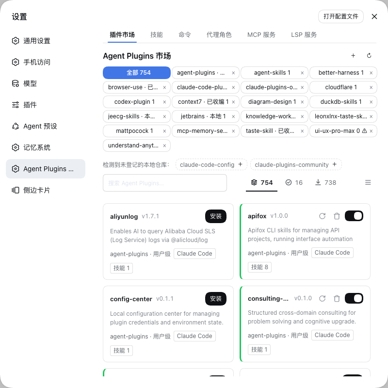

# dsh-agent-plugins-market

**[DeepSeek Harness（DSH）](https://github.com/deepseek-ai/deepseek-harness)的插件市场与 Agent 能力管理工作区。**

复用 Claude Code、Codex、Cursor、Kimi 等已识别布局中支持的内容及社区兼容布局，在 DSH Web 界面管理自己的技能、命令、代理角色、MCP 服务和 LSP 服务。支持的布局原地读取，无需转换清单或手动将文件复制到 DSH。各格式的具体限制见能力矩阵。

[English](README.md) | 简体中文 | [文档站](https://sivan757.github.io/dsh-agent-plugins-market/) | [npm](https://www.npmjs.com/package/dsh-agent-plugins-market)

[](https://www.npmjs.com/package/dsh-agent-plugins-market) [](LICENSE)

[快速开始](#快速开始) · [日常使用](#日常使用) · [兼容性](#兼容性与运行边界) · [常见问题](#常见问题)



## 你可以用它做什么

- **原地读取兼容。** 识别十种套件布局——Claude Code、Codex、Cursor、Kimi Code、ZCode、Qoder CLI、GitHub Copilot CLI、Universal `.plugin/`、agent-plugins.org v1 与无清单技能集合——以及项目原生目录；清单不转换，文件不复制进 DSH。
- **来源。** 添加 Git 仓库、本地目录或压缩包（`.zip` / `.tar.gz` / `.tgz` / `.tar`）；收编自己克隆的目录；按需刷新；删除来源时可一并删除受管目录。
- **网络与镜像。** 下载区域设置（默认 `auto` 跟随界面语言，也可显式选择全球或中国大陆）决定 `github.com` 克隆走的镜像前缀；宿主配置还可设置代理、`insteadOf` 地址重写、每次调用超时、自动克隆重试与可选的 GitHub 压缩包回退。
- **运行时能力。** 启用套件会注入会话：技能进入目录与斜杠菜单，命令以 `/名称` 调用，代理角色进入子代理目录，MCP 工具以 `mcp__` 前缀注册，hooks 挂到宿主生命周期事件，语言服务器通过 `lsp` 工具使用。各能力的条件见[运行时能力表](#兼容性与运行边界)。
- **MCP。** 内置桥接无需宿主 MCP 客户端，支持 stdio、带 OAuth 的 Streamable HTTP 和旧式 SSE。`${VAR}` 引用从宿主凭据服务解析（或回退到启动环境）；按服务覆盖可禁用或修补声明，不必修改源文件；也可选用宿主客户端兼容模式（该模式不提供 OAuth 与旧式 SSE）。工具名为 `mcp__<套件>__<服务>__<工具>`；若该命名空间已被其它 MCP 客户端占用，则跳过并给出诊断，不会重复挂载。
- **LSP。** 随插件自带：安装插件即完成全部设置，`lsp` 工具只在确有语言服务器需求时挂载；语言服务器可执行文件本身需在 `PATH` 中。
- **代理角色与委派。** 角色卡片保存精确的供应商、模型与思考强度；角色出现在会话目录中，通过 `subagent_run` 运行，立即返回可继续的后台子代理 ID；结束时运行时回报结果，运行期间可用 `send_message` 追加指令。
- **项目维度。** 项目原生的技能、代理、命令、MCP 服务与 hooks 无需安装即可原地发现；项目扫描开关控制整个维度。
- **自建资源。** 技能、命令和代理角色以 Markdown 保存于 `~/.dsh/agent-plugins/user/`，可随时编辑或禁用而不删除文件。
- **Web 工作区。** 六个页签——插件市场、技能、命令、代理角色、MCP 服务、LSP 服务——每个页签都有搜索、过滤与网格/列表切换，并提供带诊断的状态面板、凭据编辑，以及可在启用可执行第三方内容前提示风险的安装确认。
- **双语界面与反馈。** 工作区文案与注入提示跟随宿主语言；启用反馈后，模型可将 `report_market_issue` 报告提交到插件仓库，没有 token 时保存为本地记录。

## 快速开始

需要 Node.js 22+、启用了技能服务的 DSH Web profile；使用 Git 来源还需要 Git。当前仓库声明的 DSH 宿主包版本范围为 `^0.1.5-rc.2`，各项能力还取决于 profile 提供的宿主服务，详见[宿主要求](docs/guides/usage.zh.md#宿主要求)。

将 `<name>` 替换为你的 profile 名称后安装：

```sh
dsh plugin --profile <name> add dsh-agent-plugins-market
```

1. 重启 DSH，打开 **设置 → Agent Plugins 市场**。旧版外壳可能显示为顶层页面入口。
2. 在**插件市场**添加来源，例如 `https://github.com/anthropics/claude-plugins-official`。插件不预置来源。
3. 打开套件查看内容，确认后安装，并确保套件已启用。
4. 如果套件提供技能，先在**技能**页签查看，再在聊天中输入 `/` 查找允许手动调用的技能。如果提供 MCP，前往 **MCP 服务**检查状态，处理凭据或连接提示后再使用工具。

GitHub 安装和 profile 配置方式见[使用指南](docs/guides/usage.zh.md#其他安装方式)。

## 日常使用

MCP 详情将保留凭据的“重试连接”与需要确认的“重新授权”分开，详情内不再显示启用开关。

工作区包含六个页签：

| 页签     | 可以做什么                                                                                 |
| -------- | ------------------------------------------------------------------------------------------ |
| 插件市场 | 添加来源、预览套件、安装 / 卸载、启用 / 禁用和刷新。                                       |
| 技能     | 浏览技能，创建或编辑自己的可复用指令。                                                     |
| 命令     | 管理通过 `/名称` 调用的提示词模板；`$ARGUMENTS` 替换为命令后输入的文本。                   |
| 代理角色 | 管理角色指令并为每个角色保存精确的供应商、模型与思考强度；通过 `subagent_run` 在后台委派。 |
| MCP 服务 | 自行新增服务或配置已安装的服务及其凭据与授权，查看连接状态并重试失败的服务。               |
| LSP 服务 | 新增并配置语言服务器，查看运行状态。                                                       |

**来源（source）**表示内容来自哪里，**套件（suite）**是从中发现的可安装单元。添加来源用于发现套件；安装并启用套件决定其运行时能力是否生效。套件详情用于预览文件，MCP 凭据和覆盖配置在 **MCP 服务**中编辑。

自建技能、命令和角色以 Markdown 保存于 `~/.dsh/agent-plugins/user/`，项目原生资源继续保留在项目中。路径和优先级见[存储与发现](docs/guides/usage.zh.md#存储与发现)。

## 兼容性与运行边界

支持的**布局方言（layout dialect）**描述文件如何组织。[统一优先级表](#布局识别优先级)并列列出套件清单与 Marketplace 目录索引。

[`schemas/`](schemas/README.md) 中十种当前布局契约均有独立读取测试。[布局审计](docs/layout-coverage.zh.md)将它们对应到固定提交号的 README 仓库快照，并区分布局/组件兼容与完整原厂运行时等价。

支持的**运行时能力（runtime surface）**描述 DSH 能使用什么：

| 能力  | 支持情况与条件                                                                                                          |
| ----- | ----------------------------------------------------------------------------------------------------------------------- |
| 技能  | 接入宿主技能目录，允许手动调用的技能出现在斜杠菜单；展开支持的根路径占位符。                                            |
| 命令  | 通过宿主命令服务注册斜杠命令。                                                                                          |
| 代理  | 动态子代理目录与 `subagent_run`；需要宿主 agents、tools、LLM、subagents 与会话持久化服务。                              |
| MCP   | 默认使用内置桥接，支持 stdio、带 OAuth 的 Streamable HTTP 和旧式 SSE；也可切换宿主客户端兼容模式。                      |
| Hooks | 运行 `dsh-hooks-claude-code` 桥接映射支持的 command-hook 子集。                                                         |
| LSP   | 随插件自带：安装插件即安装 LSP 支持包，`lsp` 工具只在确有语言服务器需求时挂载；语言服务器可执行文件本身需在 `PATH` 中。 |

代理角色显示在会话目录中，并通过 `subagent_run(agent, prompt)` 执行：立即返回子代理 ID，在后台运行，结束时由运行时回报结果，运行期间可用 `send_message` 追加指令。角色可以保存精确的 `provider` + `model` 与 `reasoning_effort`；其余声明一律忽略，子代理改为继承父会话路由。`tools` 与 `disallowedTools` 会保留在文件中但不会生效。frontmatter 字段与边界见[代理角色](docs/guides/agent-roles.zh.md)。

### 布局识别优先级

**同一个套件目录**同时存在多个清单时，按下表顺序选择第一个存在的文件来确定布局：

| 优先级 | 布局 | 套件清单 | Marketplace 目录索引 |
| --- | --- | --- | --- |
| 1 | agent-plugins.org v1 / 根兼容清单 | `plugin.json` | 无专属索引 |
| 2 | Universal 兼容布局 | `.plugin/plugin.json` | `.plugin/marketplace.json` |
| 3 | Claude Code | `.claude-plugin/plugin.json` | `.claude-plugin/marketplace.json` |
| 4 | Cursor | `.cursor-plugin/plugin.json` | `.cursor-plugin/marketplace.json` |
| 5 | Kimi Code | `kimi.plugin.json`，其次 `.kimi-plugin/plugin.json` | `.kimi-plugin/marketplace.json` |
| 6 | Codex | `.codex-plugin/plugin.json` | `.agents/plugins/marketplace.json`，其次 `.agents/plugins/api_marketplace.json` |
| 7 | ZCode | `.zcode-plugin/plugin.json` | 无专属索引 |
| 8 | Qoder CLI | `.qoder-plugin/plugin.json` | `.qoder-plugin/marketplace.json` |
| 9 | GitHub Copilot CLI | `.github/plugin/plugin.json` | `.github/plugin/marketplace.json` |
| 回退 | 技能集合 / 共享索引 | 无已知清单时按技能集合约定发现 | 根 `marketplace.json` |

- **先选择，再解析：**高优先级清单无效时给出诊断，不会自动重试低优先级清单。
- **根清单身份：**根 `plugin.json` 只有声明了受识别的 agent-plugins.org `$schema`，才按 v1 严格校验；否则按 Claude 兼容清单读取。
- **组件补充：**通常不合并多个清单。非 v1 根 `plugin.json` 缺失的组件声明可以从 `.claude-plugin/plugin.json` 补齐；根清单中的显式声明优先，marketplace 条目声明补充剩余缺项。

**两列遵循同一布局优先级。** 索引查找跳过无专属索引的布局，同一布局的别名按表内顺序尝试。根 `marketplace.json` 是共享回退，既不是技能集合的清单，也不是 agent-plugins.org v1 的专属索引，不继承根 `plugin.json` 的优先级。

读取阶段收集所有存在的索引，套件扫描采用第一个能产出套件的索引，不会合并全部索引；无效或空索引允许继续尝试下一项。该优先级不意味着项目原生目录之间互斥。

顺序定义见 [`src/model/layouts.ts`](src/model/layouts.ts)，选择与根清单补充逻辑见 [`src/catalog/manifests.ts`](src/catalog/manifests.ts)。

### 布局能力支持矩阵

按官方文档、本插件源码与「每个 schema 一个真实仓库」逐项核验（2026-09-08）。表中描述的是**本插件接入范围**：“通用”表示仅按本插件共用目录规则读取，不代表该平台定义了对应能力；“部分”须结合下方限制阅读。[兼容性报告](docs/compat-report.md)记录抽样仓库、提交号、schema 结论与扫描器输出。

| 布局 | Skills | Agents | Commands | MCP | Hooks | LSP |
| --- | --- | --- | --- | --- | --- | --- |
| [Claude Code](https://code.claude.com/docs/en/plugins-reference) | 声明 + 默认技能 | 声明 Markdown | 声明 Markdown | 文件 / 内联 | 命令事件子集 | 文件 / 内联 |
| [Codex](https://developers.openai.com/plugins/build/plugins) | 支持 | 通用 | 通用 | 部分：`.mcp.json` | 兼容事件子集 | 通用内联 |
| [Cursor](https://cursor.com/docs/reference/plugins) | 支持 | 部分：仅 `.md` | 部分：仅 `.md` | 部分：见下方限制 | 原生事件不支持 | 通用内联 |
| Kimi Code | 声明技能 + 启动技能 | 声明 Markdown | 声明命令 | 内联 | 内联命令事件 | 通用扩展，非原生 |
| [ZCode](https://zcode.z.ai/en/docs/plugin) `.zcode-plugin/` | 通用 | 通用 | 通用 | `.mcp.json` + 内联覆盖 | 通用 | 通用内联，非原生 |
| [Qoder CLI](https://docs.qoder.com/cli/plugins-reference) `.qoder-plugin/` | 通用 | 通用 | 通用 | 部分：优先 `.mcp.json` | 通用 | 通用内联，非原生 |
| [GitHub Copilot CLI](https://docs.github.com/en/copilot/reference/copilot-cli-reference/cli-plugin-reference) | 声明技能 | `.md` / `.agent.md` | 声明 Markdown | 文件 / 内联 | 映射命令事件 | 文件 / 内联 |
| Universal 兼容布局 `.plugin/` | 通用 | 通用 | 通用 | 通用 | Claude 格式子集 | 通用内联 |
| [agent-plugins.org v1](https://agent-plugins.org/specification) | 支持 | 通用，非标准 | 通用，非标准 | 标准 `mcp.json` | 通用，非标准 | 仅目录预览，非标准 |
| 无清单技能集合 | 支持 | 通用 | 通用 | 通用文件 | Claude 格式子集 | 仅目录预览 |
| 项目原生目录（见下文） | 支持 | 可移植 Markdown 角色 | 会话作用域命令 | JSON / Codex TOML | 已映射命令事件子集 | 诊断，不挂载 |

- **组件路径：**支持声明文件、目录树和数组，按 realpath 限制在套件内部。命令、代理和详情面板消费同一组资源。Cursor 命令还支持 `.mdc`、`.markdown`、`.txt`；Qoder 命令映射支持文件与内联内容。Claude/Codex 技能声明补充默认发现；无清单集合也支持平铺技能 Markdown 文件。
- **代理角色：**角色通过会话目录和 `subagent_run` 使用，不注册为技能或斜杠命令。
- **MCP：**按方言解析声明文件、内联表和数组。支持 Cursor 无 schema 的 `mcp.json`；agent-plugins v1 保持严格 schema 校验。Claude/ZCode 声明叠加默认配置，Cursor 声明替换默认配置，Copilot/Universal 包含 `.github/mcp.json`，Kimi Code 使用内联声明。无效显式配置不会复活默认配置。Codex app 连接器不属于此适配器。
- **Hooks：**支持声明文件/目录及内联配置，包括 Kimi 数组和保留 argv 引用边界的 ZCode process hooks。受支持的 Copilot/Cursor 生命周期名称映射到已有 command-hook 桥。没有 DSH 对应点的事件（如 `afterFileEdit`）给出诊断，不伪造执行。
- **LSP：**用户套件支持声明文件、数组、内联表，以及 `.lsp.json` 和 Copilot/Universal 的 `lsp.json`、`.github/lsp.json`、`lsp-config/servers.json`。反向域名目录定义仍为预览。项目 LSP 保留宿主作用域限制。
- **规范边界：**agent-plugins.org v1 的可移植核心只有 skills 与 MCP，不能把通用 agents / commands / hooks 扫描称为标准能力。Universal 是本插件识别的兼容布局名称：[OpenHands SDK](https://docs.openhands.dev/sdk/guides/plugins)文档同样使用 `.plugin/plugin.json`，[Vercel 仓库](https://github.com/vercel/vercel-plugin/blob/main/.plugin/plugin.json)也在使用，但不存在跨厂商规范。
- **Kimi Code：**当前 schema 覆盖两种清单路径、启动技能、附加技能指令、系统提示、内联 hooks 和 catalog 别名。历史 `kimi-cli` 根 tools 协议是另一套系统，不能与当前 Kimi Code schema 混淆。
- **ZCode 边界：**已识别 `.zcode-plugin/plugin.json` 与根 `marketplace.json`，包含按名称索引的插件表。内联 MCP 按同名键覆盖 `.mcp.json`。尚未实现 marketplace 的 zip + `sha256` 分发契约。
- **Qoder 边界：**已识别 `.qoder-plugin/plugin.json` 与 `.qoder-plugin/marketplace.json`。MCP 优先读取 `.mcp.json`，无 schema 的 `mcp.json` 作为回退。
- **GitHub Copilot CLI：**`.plugin/plugin.json` 保留 Universal 身份。两种路径均消费声明组件及默认 MCP/LSP 文件。隔离测试在嵌套套件根也去除竞争清单，防止 Claude 回退冒充 Copilot 测试通过。
- **项目目录：**[Claude 项目技能](https://code.claude.com/docs/en/skills)与 [Codex 的 `.agents/skills`](https://developers.openai.com/codex/skills)有官方依据；`.agents/agents`、`.agents/commands` 是本插件的通用发现约定。

### 项目布局开关

插件设置卡提供**扫描项目 Agent 布局**（`dsh-agent-plugins-market.scanProjectLayouts`，默认 `true`）。关闭后立即移除本插件的项目原生候选；配置源与宿主自身的技能提供器独立运行。文件原位只读，不安装、不改写、不删除。

注册表读取 `.claude`、`.agents`、`.codex`、`.cursor`、`.kimi`、`.zcode`、`.qoder`、`.github` 下的技能。除 `.codex` 与 `.kimi` 外启用可移植 Markdown agents；两者的 TOML/YAML 格式需要独立适配器。角色执行按调用会话确定项目。项目 commands、受支持的 MCP 服务和已映射命令 hooks 注册在各 Agent 独立作用域，会话启动或目录变更通知时刷新，关闭总开关即撤销。

MCP 读取根 `.mcp.json`、`.cursor/mcp.json`，以及 `.qoder/settings.json`、`.qoder/settings.local.json` 的 `mcpServers` 表（本机配置覆盖同名项目配置）。ZCode 读取 `zcode.json`、`.zcode/config.json` 的 `mcp.servers`，原生表为空时回退到 `.agents/mcp.json`。Codex 通过 `smol-toml` 读取 `.codex/config.toml` 的 `[mcp_servers.*]`，保留 stdio/HTTP 配置、环境变量/请求头引用、启停、工具过滤和超时。不支持的服务字段会报诊断，宿主客户端模式会拒绝无法执行的策略。相对可执行路径从项目根解析。Claude/Qoder 设置 hooks 与明确启用的 ZCode 配置 hooks 使用桥支持的命令事件子集。校验后的 hooks 写入私有运行时临时文件，销毁时删除，项目原文件保持不变。项目 LSP 给出诊断且不挂载，修改宿主不属于本插件范围。见[架构决策与支持边界](docs/adr/2026-09-09-layout-registry.md)。

### 抽样验证

`schemas/` 中的每个 schema 都会对照一个真实仓库核验——取 GitHub 代码搜索为该布局返回的 star 最高候选（2026-09-08）——再用本插件自己的扫描器读取该 checkout。九个样本中有六个**被遮蔽（shadowed）**：仓库同时提供多种方言，优先级更高的清单胜出，因此能力面仍被发现，但抽样方言自身的身份未被采用。[兼容性报告](docs/compat-report.md)记录了提交号、schema 错误与扫描备注。

| 布局 | 抽样仓库 | 方言清单 | Schema | 扫描器 |
| --- | --- | --- | --- | --- |
| Claude Code | [grafana/mcp-grafana](https://github.com/grafana/mcp-grafana) | `.claude-plugin/plugin.json` | 通过 | 接入 |
| Codex | [saadeghi/daisyui](https://github.com/saadeghi/daisyui) | `.codex-plugin/plugin.json` | 通过 | 被遮蔽 |
| Cursor | [EveryInc/compound-engineering-plugin](https://github.com/EveryInc/compound-engineering-plugin) | `.cursor-plugin/plugin.json` + marketplace | 通过 | 被遮蔽 |
| Kimi | [obra/superpowers](https://github.com/obra/superpowers) | `.kimi-plugin/plugin.json` | 通过 | 被遮蔽 |
| Universal | [muratcankoylan/Agent-Skills-for-Context-Engineering](https://github.com/muratcankoylan/Agent-Skills-for-Context-Engineering) | `.plugin/plugin.json` | 通过 | 接入 |
| agent-plugins.org v1 | [saadeghi/daisyui](https://github.com/saadeghi/daisyui) | `plugin.json` | 通过 | 接入 |
| ZCode | [zenstory-ai/oh-story-claudecode](https://github.com/zenstory-ai/oh-story-claudecode) | `.zcode-plugin/plugin.json` + `marketplace.json` | 通过 | 被遮蔽 |
| Qoder CLI | [DietrichGebert/ponytail](https://github.com/DietrichGebert/ponytail) | `.qoder-plugin/plugin.json` | 通过 | 被遮蔽 |
| GitHub Copilot CLI | [headroomlabs-ai/headroom](https://github.com/headroomlabs-ai/headroom) | `.github/plugin/marketplace.json` | 通过 | 被遮蔽 |

**扫描器**列描述未修改的仓库：**接入**表示自身清单胜出，**被遮蔽**表示其它方言胜出，**未读取**表示无套件。它与单布局隔离测试分开判断。无清单集合使用真实 Universal 仓库技能、在测试中移除清单验证，补齐十种布局覆盖。快照位于 `tests/fixtures/real-layouts/`，保留提交号、文件哈希与许可证，详见[审计表](docs/layout-coverage.zh.md)。

核验依据包括 `src/catalog/manifests.ts`、`surfaces.ts`、`validate.ts`、`native-project.ts` 与 `src/runtime/hooks-mounts.ts`。[兼容性报告](docs/compat-report.md)补充「每个 schema 一个真实仓库」并由本插件扫描器实测。这是文档、源码与抽样核验，并非每个平台的端到端兼容认证。

能读取一种布局，并不保证复现原平台的全部行为。无效声明会被诊断并跳过。项目原生命令与受支持的 MCP 服务使用宿主的 Agent 作用域注册；项目 MCP 服务名包含会话身份，以避免应用级命名冲突。

启用第三方套件前请检查其内容：启用的服务和 hooks 可以执行程序。详见[运行时与安全边界](docs/guides/usage.zh.md#运行时与安全边界)。

## 常见问题

**安装后为什么找不到技能或工具？**

检查套件及对应能力是否启用。技能可能限制手动调用；MCP / LSP 面板显示用户服务故障。项目资源还需要开启项目扫描；不支持的原生字段与项目 LSP 声明进入扫描诊断，作用域挂载错误记录在宿主日志中。

**在哪里配置 MCP token？**

在 **MCP 服务**中打开对应服务。缺失环境变量引用时显示 `needs-credentials`。宿主管理的凭据只写不读；启动环境中的凭据需要修改环境后重启 DSH。

**套件没有声明的服务怎么添加？**

在 **MCP 服务**或 **LSP 服务**中点击新增并填入声明。声明会先校验，保存到 `~/.dsh/agent-plugins/data/` 下，并与套件服务走同一套挂载生命周期。从宿主配置观察到的服务保持只读。

**来源下载失败怎么办？**

可以使用本地目录、收编手动克隆的仓库，或配置代理与镜像，见[配置市场源](docs/guides/usage.zh.md#配置市场源)。

**本地修改什么时候生效？**

没有文件监听。本地来源的发现结果最多缓存 30 秒，刷新来源可立即使缓存失效。项目发现有独立的五秒缓存。已经打开的页面不会自动刷新。

**删除来源会删除文件吗？**

只有勾选确认框里的「同时删除市场目录」才会删除。它删除该源在 `~/.dsh/agent-plugins/.sources/<id>` 下的目录——包括你手动克隆后被收编的目录。指向 `.sources/` 之外的本地目录源永不删除。

## 更多文档

- [使用指南](docs/guides/usage.zh.md)：安装、来源配置、存储、宿主要求、MCP / LSP 和反馈设置。
- [插件规范](schemas/README.md)：各布局的参考 schema 与依据，以及内置的 agent-plugins.org v1.0.0 契约。
- [兼容性报告](docs/compat-report.md)：每个 schema 一个真实仓库，含提交号、schema 结论与扫描器输出。
- [贡献指南](CONTRIBUTING.md)：开发环境、检查命令和 PR 流程。
- [安全政策](SECURITY.md) · [版本记录](CHANGELOG.md) · [MIT 许可](LICENSE)。
- [领域词汇](CONTEXT.md) · [架构设计](docs/adr/0001-catalog-centered-modular-refactor.md)。

已安装资源编辑、角色模型路由与目录迁移见[代理角色与存储](docs/guides/agent-roles.zh.md)。
